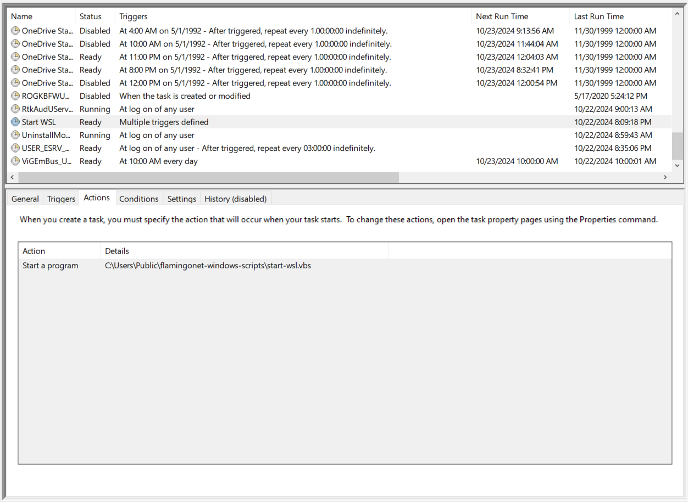

<!-- Project Logo -->
 

  

  <h3 align="center">FlamingoNet - Windows Scripts</h3>

  

    Scripts for configuring FlamingoNet on Windows clients using WSL (Windows Subsystem for Linux).
  

<!-- Overview -->
## Overview

The FlamingoNet is a personal cloud made up of a Linux server and its network of client devices.
It offers the following features:
* DNS (Domain Name Server)
* Cloud Storage and Backup (NAS - Network Attached Storage)
* Web App Hosting

This repository contains scripts to configure a Windows client to interact with the FlamingoNet. The primary purpose of these scripts is to start up WSL
when a user logs into their Windows system. WSL does not start automatically with Windows,
so asynchronous processes such as file syncing and backups would not work unless the user
had deliberately started WSL.

The goal is to **silently** start WSL when a Windows user logs in. Unfortunately, running
a batch script causes a prompt to appear during login. Therefore, `scripts/start-wsl.vbs`,
a Visual Basic script, will run `scripts/start-wsl.bat` silently. `scripts/start-wsl.bat`
contains a simple command that starts a wsl login shell and runs a dummy command, `true`.

<!-- Installation -->
## Installation
Run `deploy.bat` to deploy the scripts to your Windows system under the Public user folder,
`C:\Users\Public\flamingonet-windows-scripts\`. Then, to run `scripts/start-wsl.vbs` on login,
open the Windows Task Scheduler and make a new task named, Start WSL. Add a new action to this
task and point it to where `start-wsl.vbs` was deployed.

A login trigger can then be added to execute the script whenever a user logs in.

